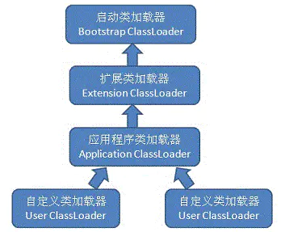

# 类加载的时机
类从被加载到虚拟机内存开始，直到卸载出内存为止，它的整个生命周期包括：加载、验证、准备、解析、初始化、使用、卸载7个阶段。其中验证、准备、解析3个部分统称为连接。
加载、验证、准备、初始化、使用、卸载这几个阶段的顺序是确定的，而解析可以在初始化之后进行。

虚拟机规范<font color=red>没有约束加载的时机，但是严格规定了初始化的时机</font>，只有下述5种情况会对类进行"初始化"（而加载、验证、准备）需要在此之前开始。
1. new关键字实例化一个对象、读取或者设置一个静态变量（被final修饰的除外，因为已经在编译期放到常量池）、调用一个类的静态方法。
2. 使用java.lang.reflect包的方法对类进行反射调用时
3. 初始化一个类，如果父类没有初始化，先触发父类的初始化
4. 虚拟机启动时，用户指定一个要执行的主类（main（）方法的类），虚拟机会先初始化这个主类。
5. jdk1.7动态语言（不清楚）
以上5种场景称为对一个类进行主动引用，除此之外，所有其他引用类的方式都不会触发初始化，称为被动引用。

被动引用案例：
-   子类引用父类的静态变量
-   new 数组类
-   引用类的静态常量 static final变量
# 类加载的过程
java虚拟机中类加载的过程包括：加载、验证、准备、解析、初始化5个阶段
## 加载
加载阶段虚拟机需要完成三件事
1. 通过一个类的全限定名来获取定义此类的二进制流（从zip包读取，从网络中读取，运行时计算生成，从数据库获取，由其他文件生成）
2. 将这个字节流所代表的静态存储结构转换为方法区的运行时数据结构（虚拟机规范未规定此区域的具体数据结构）
3. 在内存中生成一个代表这个类的java.lang.Class对象（虚拟机规范没有约定是否放在堆中，hotspot虚拟机将此对象放在了方法区）  

数组类本身不通过类加载器创建，而是由jvm直接创建。创建出来的数组类Class是类似[Lcom.baosiling.HelloTest

加载阶段与连接阶段的部分内容是交叉进行的，也就是加载阶段尚未完成，连接阶段可能已经开始了。但是这两个阶段的开始时间是遵从上面说的先后顺序的。
## 验证
验证的目的是为了确保Class文件的字节流中包含的信息符合当前虚拟机的要求，并且不会虚拟机自身的安全。
验证阶段大致会完成下面4个阶段的校验动作：
1. 文件格式验证（验证字节流是否符合Class文件格式规范，并能被当前版本的虚拟机处理）
2. 元数据验证（对字节码描述的信息进行语义分析，以保证描述的信息符合java语言规范的要求）
3. 字节码验证（通过数据流和控制流分析，确定语义是合法的、符合逻辑的）
4. 符号引用验证（这个阶段是在符号引用转化为直接引用时校验的，也就是解析阶段。从这里看到验证穿插在类加载的多个阶段里面）。
## 准备
准备阶段是正式为类变量（静态变量）分配内存并设置变量初始值的阶段，这些变量所使用的内存即将在方法区中进行分配。
这个阶段只分配类变量的内存，不包括实例变量；非final的类变量赋零值，不会赋值下面代码中的123给value。
把value赋值为123的动作是在类构造器`<clinit>`()方法中，也就是在初始化阶段才会执行。
```java
public static int value = 123;
```
如果类变量有final修饰，编译时java将会在常量池为value生成ConstantValue属性，在准备阶段虚拟机会根据ConstantValue的设置将value赋值为123。
```java
public static final int value = 123;
```
## 解析
解析阶段是虚拟机将常量池内的符号引用替换为直接引用的过程。 //TODO
1. 类或接口的解析
2. 字段解析
3. 类方法解析
4. 接口方法解析
## 初始化
前面类加载的过程中，除了在加载阶段用户应用程序可以通过自定义类加载器参与之外，其余动作完全有虚拟机主导和控制，到了初始化阶段，才真正开始执行类中定义的java程序代码。
类初始化阶段是执行类构造器`<clinit>`()方法的过程。
`<clinit>`()方法是由编译器自动收集类中的所有类变量的赋值动作和静态语句块中的语句合并产生的，编译器收集的顺序是由语句在源文件中出现的顺序决定的，静态语句块中只能访问到定义在静态语句块之前的变量，定义在它之后的变量，在前面的静态语句块中可以赋值，但是不能访问。
```java
public class Test{
    static {
        i = 2;  //给变量赋值可以正常编译通过
        System.out.println(i);  //编译器提示非法向前引用
    }
    static int i = 1;

    public static void main(String[] args) {
        System.out.println(i);
    }
}
```
虚拟机会保证一个类的`<clinit>`()方法在多线程环境中被正确地加锁、同步，如果多个线程同时去初始化一个类，那么只会有一个线程去执行这个类的`<clinit>`()方法，其他线程都需要阻塞等待，直到活动线程执行`<clinit>`()方法完毕。
## 类加载器
类加载器的工作是通过一个类的全限定名来获取描述此类的二进制字节流。


### 自己实现一个类加载器
### 打破双亲委派机制
mysql driver需要注册到DriverManager中，DriverManager类是由启动类加载器加载的，但是mysqlDriver的驱动类是由子级类加载器来加载，从双亲委派模型上来说不可能的，但是父级类加载器可以通过线程上下文加载器来加载mysqlDriver
> https://juejin.im/post/5dd10db651882510c959279b#heading-18
https://juejin.im/post/5dece9a751882512727f1a91