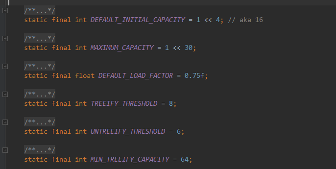
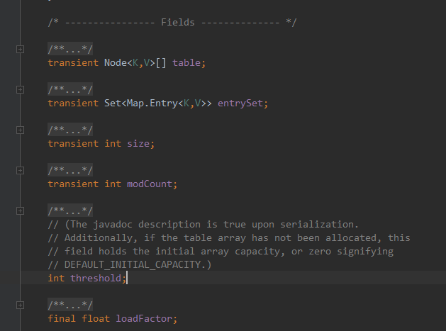
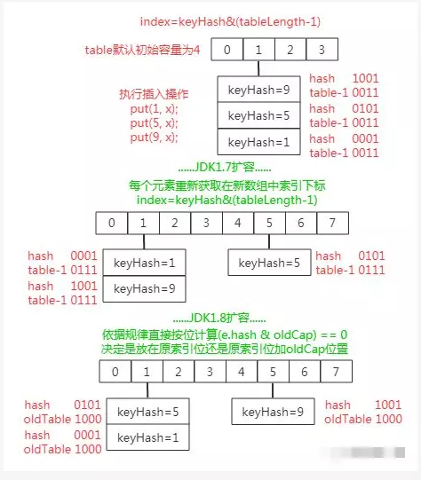

### 构造方法


```
    int threshold;
    final float loadFactor;
```

最常用的是下面两个
```
    Map<String,String> map = new HashMap<>(16);
    Map<String,String> map = new HashMap<>();

    public HashMap(int initialCapacity) {
        this(initialCapacity, DEFAULT_LOAD_FACTOR);
    }
    public HashMap() {
        this.loadFactor = DEFAULT_LOAD_FACTOR; // all other fields defaulted
    }
```
这两个方法 赋值了初始容量initialCapacity、负载因子loadFactor
这里调用了一个方法来计算容量cap的大小
```
    /**
     * Returns a power of two size for the given target capacity.
     */
    static final int tableSizeFor(int cap) {
        int n = cap - 1;
        n |= n >>> 1;
        n |= n >>> 2;
        n |= n >>> 4;
        n |= n >>> 8;
        n |= n >>> 16;
        return (n < 0) ? 1 : (n >= MAXIMUM_CAPACITY) ? MAXIMUM_CAPACITY : n + 1;
    }
```
第一次 向右移1位再与自己或运算，相当于把自身从左起前2位变为1了，后续操作依次将自身从左起4位，8位，16位，32位变为1，
所以即使hashmap是最大容量MAXIMUM_CAPACITY，经过这些操作，也会将自身所有有效位变为1，最后return n+1,就是2的整数幂。

cap-1 的目的是如果cap本身是2的整数幂能保证返回结果就是它自身。否则会结果会*2

以上是构造方法的逻辑，**就是确定数组的初始容量大小以及负载因子，但是并没有初始化Node<K,V>[] table。**
### PUT
put的内容比较多，逻辑相对复杂 重写AbstractMap的put方法
```
    public V put(K key, V value)

    static final int hash(Object key) {
        int h;
        return (key == null) ? 0 : (h = key.hashCode()) ^ (h >>> 16);
    }

    final V putVal(int hash, K key, V value, boolean onlyIfAbsent,
                   boolean evict)
```
#### hash值以及索引的计算
put执行时首先会计算key的hash值，可以看到是用key对象的hashCode进行计算得到的
-   key.hashCode();一般情况我们使用的key，大都是字符串，可以看一下String类的hashCode()方法，得到的是一个int值（hashCode就是为每个对象分配一个整数，相同的对象数值一样，不同的对象数值不一样，这里的一样与否很多时候取决于自己的需求，所以大部分情况我们需要为自定义的类重写hashCode，Object的hashCode方法实际是调用本地方法，返回一个虚拟地址，这种大部分都满足不了要求，所以需要重写hashCode方法。）
-   因为能力有限，hashCode的算法不深究了，总之是在性能和hash效果之间权衡。
-   来看HashMap的hash计算方法 (h = key.hashCode()) ^ (h >>> 16)
因为h是个int值32位的，无符号右移16位，然后与自身异或=》先看h<216次幂，右移16位后 都变为0 0与任何数异或都不变 ，所以小于216次幂的key，都是自身的hashCode
再看h>216次幂，右移16位后，低16位都变为0，高16位转移到低16位，再与自身异或，这样的效果就是 **自己的高半区和低半区做异或，就是为了混合原始哈希码的高位和低位，以此来加大低位的随机性**
-   有了hash值，再看剩下的逻辑
#### put逻辑
```
    final V putVal(int hash, K key, V value, boolean onlyIfAbsent,
                   boolean evict) {
        Node<K,V>[] tab; Node<K,V> p; int n, i;
        //如果数组为空进行初始化，这里使用的扩容方法resize()进行初始化的
        if ((tab = table) == null || (n = tab.length) == 0)
            n = (tab = resize()).length;
        //通过key的hash值计算其在数组中的索引，(n-1)&hash等价于取模操作，位运算效率更高；
        //如果该索引位置为null，说明之前没有put过这个key，就新建一个Node
        if ((p = tab[i = (n - 1) & hash]) == null)
            tab[i] = newNode(hash, key, value, null);
        //如果要落的位置不为null
        else {
            Node<K,V> e; K k;
            //取第一个节点（因为大部分key都是占用了第一个Node），判断hash和key都和原值相等，说明put的是同一个key，后面替换当前key对应的value
            if (p.hash == hash &&
                ((k = p.key) == key || (key != null && key.equals(k))))
                e = p;
            //如果该索引位置的结构是树，就用树的逻辑put,返回的e是旧值
            else if (p instanceof TreeNode)
                e = ((TreeNode<K,V>)p).putTreeVal(this, tab, hash, key, value);
            //上述条件不满足，说明存在hash碰撞，遍历链表，在Node链表的后端插入新值
            else {
                for (int binCount = 0; ; ++binCount) {
                    //遍历到链表最后一位，在该位置插入一个新的Node，可以看到是后插法
                    if ((e = p.next) == null) {
                        p.next = newNode(hash, key, value, null);
                        //这里如果链表的节点数大于树化的阈值，就会将链表转换为树
                        if (binCount >= TREEIFY_THRESHOLD - 1) // -1 for 1st
                            treeifyBin(tab, hash);
                        break;
                    }
                    //遍历过程中发现有相同的key，结束遍历，后面替换当前的key对应的value
                    if (e.hash == hash &&
                        ((k = e.key) == key || (key != null && key.equals(k))))
                        break;
                    p = e;
                }
            }
            //如果有旧值，说明有相同key，替换当前key对应的value
            if (e != null) { // existing mapping for key
                V oldValue = e.value;
                //onlyAbsent[“存在put的标志”]为false,才会替换
                if (!onlyIfAbsent || oldValue == null)
                    e.value = value;
                //linkedHashMap逻辑
                afterNodeAccess(e);
                return oldValue;
            }
        }
        //每次put操作，modCount++(hashmap迭代时会用到这个字段，fail-fast机制)，size++(hashmap容量>阈值 会扩容)
        ++modCount;
        if (++size > threshold)
            resize();
        //linkedHashMap逻辑
        afterNodeInsertion(evict);
        return null;
    }
```
#### 扩容[resize()]逻辑
```
    final Node<K,V>[] resize() {
        Node<K,V>[] oldTab = table;
        int oldCap = (oldTab == null) ? 0 : oldTab.length;
        int oldThr = threshold;
        int newCap, newThr = 0;
        if (oldCap > 0) {
            if (oldCap >= MAXIMUM_CAPACITY) {
                threshold = Integer.MAX_VALUE;
                return oldTab;
            }
            else if ((newCap = oldCap << 1) < MAXIMUM_CAPACITY &&
                     oldCap >= DEFAULT_INITIAL_CAPACITY)
                newThr = oldThr << 1; // double threshold
        }
        //hashMap使用自定义容量构造时，取根据自定义容量计算出的数组大小，这里的oldThr传递了tableSizeFor计算出来的数组大小
        else if (oldThr > 0) // initial capacity was placed in threshold
            newCap = oldThr;
        //初始化hashmap数组大小，putVal中初始化hashmap的容量走这个分支
        //注意只是赋值了数组大小，负载阈值，真正的数组初始化在下面
        else {               // zero initial threshold signifies using defaults
            newCap = DEFAULT_INITIAL_CAPACITY;
            newThr = (int)(DEFAULT_LOAD_FACTOR * DEFAULT_INITIAL_CAPACITY);
        }
        //自定义hashMap容量时，根据指定的容量和指定负载因子，赋值数组大小，负载阈值。
        if (newThr == 0) {
            float ft = (float)newCap * loadFactor;
            newThr = (newCap < MAXIMUM_CAPACITY && ft < (float)MAXIMUM_CAPACITY ?
                      (int)ft : Integer.MAX_VALUE);
        }
        threshold = newThr;
        @SuppressWarnings({"rawtypes","unchecked"})
        //使用商品得到的数组大小，初始化数组，这里才是真正初始化数组
            Node<K,V>[] newTab = (Node<K,V>[])new Node[newCap];
        table = newTab;
        //这里初始化时，oldTab为null，直接跳过这个分支 return了。
        //oldTab不为null 说明是hashmap中已经有数据了，执行真正的扩容逻辑
        if (oldTab != null) {
            for (int j = 0; j < oldCap; ++j) {
                Node<K,V> e;
                //将旧数组上的节点赋值给新变量e，该索引位置有值走下面逻辑转移到新扩容的数组
                if ((e = oldTab[j]) != null) {
                    //已经赋值给了e,将原来的旧数据置null
                    oldTab[j] = null;
                    //该索引位置只有一个Node，最简单的分支，直接将计算其在新数组的索引位置，并赋值
                    if (e.next == null)
                        newTab[e.hash & (newCap - 1)] = e;
                    //如果该索引位置是红黑树结构,使用树的逻辑转移节点到新数组
                    else if (e instanceof TreeNode)
                        ((TreeNode<K,V>)e).split(this, newTab, j, oldCap);
                    //该索引位置是链表，用key的hash值与oldCap与操作，如果是0，依然选择原来的索引位置，否则将原来的索引值+oldCap。
                    else { // preserve order
                        Node<K,V> loHead = null, loTail = null;
                        Node<K,V> hiHead = null, hiTail = null;
                        Node<K,V> next;
                        //这个循环 实际是把旧数组链表中的每个节点计算新的索引位置（可能在原位，也可能在高位），然后组成两个新的链表（一个low，一个high），挂在不同的索引上。
                        //期间每次赋值后，都会把loTail.next的值指向自己，所以原有节点的next值都会被覆盖了
                        do {
                            next = e.next;
                            if ((e.hash & oldCap) == 0) {
                                if (loTail == null)
                                    loHead = e;
                                else
                                    loTail.next = e;
                                loTail = e;
                            }
                            else {
                                if (hiTail == null)
                                    hiHead = e;
                                else
                                    hiTail.next = e;
                                hiTail = e;
                            }
                        } while ((e = next) != null);
                        //这里将旧的节点的next值直接赋null，因为链表上所有的节点都重新计算找到了新的位置，以前的next节点就要置null
                        if (loTail != null) {
                            loTail.next = null;
                            newTab[j] = loHead;
                        }
                        if (hiTail != null) {
                            hiTail.next = null;
                            newTab[j + oldCap] = hiHead;
                        }
                    }
                }
            }
        }
        return newTab;
    }
```

### GET
### REMOVE
### 遍历

### 参考资料
>https://www.cnblogs.com/lycroseup/p/7344321.html
https://blog.csdn.net/anxpp/article/details/51234835
https://blog.csdn.net/qq_38182963/article/details/78940047
https://www.cnblogs.com/loading4/p/6239441.html
https://my.oschina.net/u/232911/blog/2872356
https://www.javadoop.com/post/hashmap
https://www.jianshu.com/p/bdfd5f98cc31
https://blog.csdn.net/u013494765/article/details/77837338

