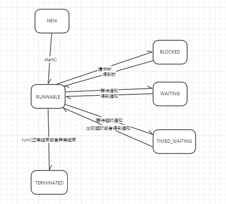

#   线程状态
java线程状态是由一个Thread的内部枚举类来定义的，代码有注释注明了该线程状态的意义
```java
    public enum State {
        /**
         * 未启动状态，很好理解，Thread new出来之后 start()方法调用之前
         */
        NEW,
        /**
         * 可运行状态，此时线程有可能正在运行，也有可能等待cpu资源
         */
        RUNNABLE,
        /**
         * 阻塞状态，获取正在被其他线程占用的锁（非concurrent包下的锁），线程就会进入阻塞状态
         */
        BLOCKED,
        /**
         * 等待状态，调用Object.wait(),Thread.join(),LockSupport.park()线程会进入等待状态。
         * 等待相应的线程完成既定的动作结束等待状态
         */
        WAITING,
        /**
         * 等待状态，调用有超时时间的Object.wait(),Thread.join(),LockSupport.park()方法，
         * 在等待时间内线程处于TIMED_WAITING状态
         */
        TIMED_WAITING,
        /**
         * 终止状态，线程的run方法执行完毕；run方法有未捕获的异常异常结束。
         */
        TERMINATED;
    }
```
##  线程状态流转图

